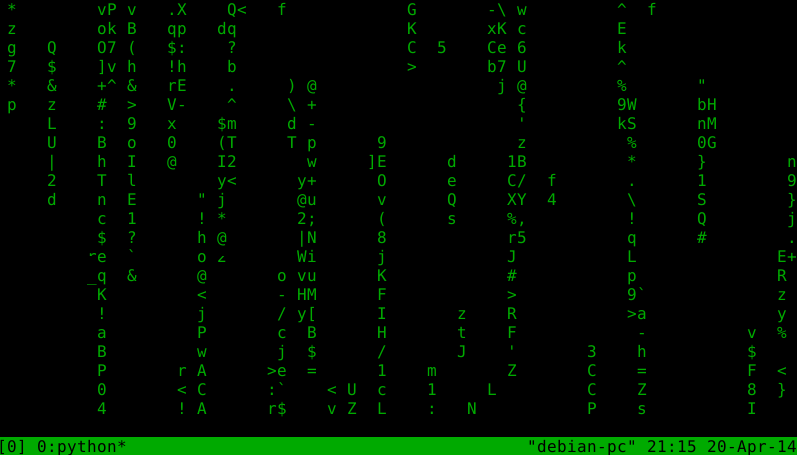

pmatrix
=======

pmatrix is a cmatrix clone written in Python. It creates the falling text display. It is worth noting that this application will only work on UNIX systems; the Python curses module responsible for terminal control is currently only supported on UNIX.

Installation
============

Installing pmatrix is easy. If you're running a UNIX system, you can follow these steps:

1. Get the source. `$ git clone https://github.com/jce-devel/pmatrix`
2. Enter the source directory. `$ cd pmatrix`
3. If you don't have sudo installed/configured, execute the setup.py file as the root user. `$ su && python setup.py install`
4. if you have sudo installed, log in as a sudoer and execute the setup.py file with sudo. `$ sudo setup.py install`
5. Done! It should now be a simple case of executing `$ pmatrix` in your favorite terminal emulator.

pmatrix in Action
=================

TODO
====

* Work on efficiency. You will always have to expect some overhead with Python and accept the fact that pmatrix will never be as fast as cmatrix.
* Parallelize loops.
